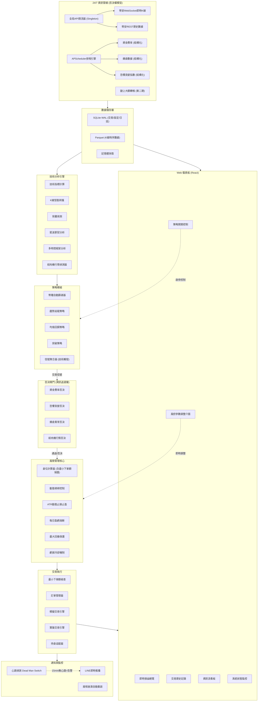
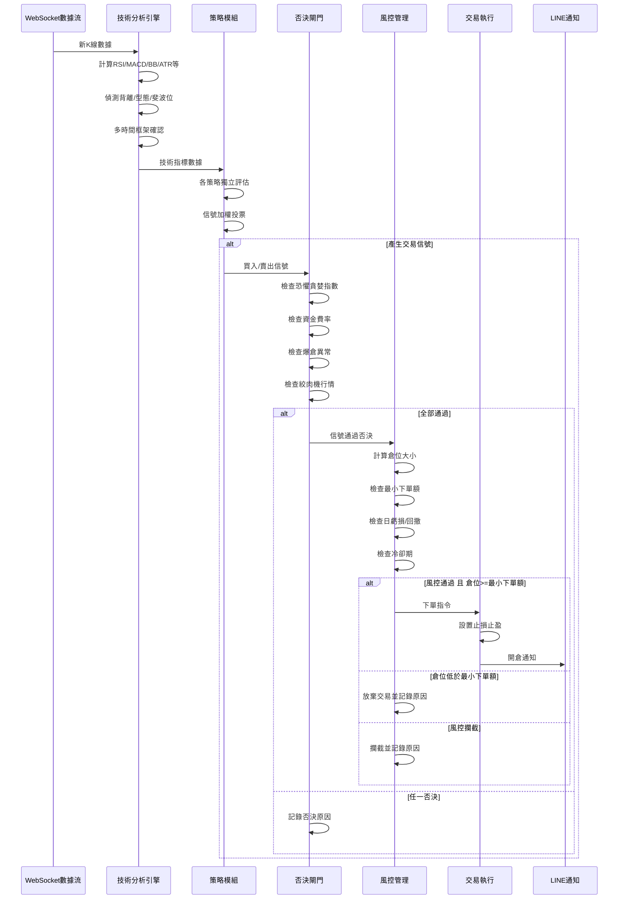

# 加密貨幣自動交易系統 v3 - 完整計畫

> 起始資金: 300 USDT | 運行方式: 本地 24/7 | 交易類型: USDT 永續合約
> 核心原則: **技術指標觸發，資訊管線否決，風控不可妥協**
> 通知方式: LINE Messaging API (單向通知，控制用 Web 儀表板)

---

## 系統總覽架構



---

## 核心設計原則

### 原則 1: 資訊管線採「否決權」模型，而非「觸發權」

- **技術指標**是唯一的開單觸發源
- **資訊管線**只負責「過濾/否決」不合適的交易:
  - 恐懼貪婪指數 > 80 (極度貪婪) -> 否決做多信號
  - 恐懼貪婪指數 < 20 (極度恐懼) -> 否決做空信號
  - 資金費率 > 0.1% -> 否決做多 (多頭過度擁擠)
  - 資金費率 < -0.1% -> 否決做空 (空頭過度擁擠)
  - 15 分鐘內出現大額連環爆倉 -> 暫停所有開單 30 分鐘

### 原則 2: 初期拔除 NLP，聚焦結構化數據

- **優先實作** (第一期): 資金費率、爆倉數據、恐懼貪婪指數
- **延後實作** (第二期): 鏈上鯨魚監控
- **暫不實作**: 新聞 NLP、社群情緒分析

### 原則 3: 全局 API 限流器 (防止被 Ban)

- `RateLimiter` 單例模式，所有幣安 API 請求必須經過
- 追蹤每分鐘 API 權重消耗，接近上限時自動排隊等待
- CoinScreener 全市場掃描改為分批查詢

### 原則 4: 小資金最小下單額保護

- 倉位 < 交易所最小下單額 -> 放棄交易（不破壞風控）
- 倉位數根據資金自適應: <500U=1倉, 500-1000U=2倉, >1000U=3倉

### 原則 5: 絞肉機行情偵測

- 15 分鐘 K 線高低差 > 2 ATR 但收盤變化 < 0.3 ATR -> 暫停開單 1 小時

---

## 數據儲存架構

- **SQLite + WAL 模式**: 交易記錄、信號、風控參數、日誌、排程狀態
- **Parquet 檔案**: K 線歷史數據 (按幣種+時間框架分檔，適合回測)
- **記憶體快取**: 最近 N 根 K 線、當前持倉、最新資金費率/恐懼貪婪

---

## 技術棧

- **語言**: Python 3.14+
- **前端**: React 18 + TypeScript + TailwindCSS + Recharts + lightweight-charts
- **後端 API**: FastAPI (REST + WebSocket 推送)
- **交易所**: ccxt + python-binance
- **技術分析**: ta (Technical Analysis Library，因 Python 3.14 不支援 pandas-ta 的 numba)
- **數據儲存**: SQLite-WAL + Parquet + dict 記憶體快取
- **排程**: APScheduler
- **通知**: LINE Messaging API (免費 200 則/月，心跳採靜默模式)
- **回測**: 自建引擎
- **穩定性**: Watchdog 自動重啟 + LINE 心跳 Dead Man's Switch

---

## 專案目錄結構

```
TradingBrain/
├── config/
│   ├── settings.py              # 全局配置 + 環境變數
│   ├── risk_defaults.json       # 風控參數預設值 (保守/穩健/積極)
│   ├── strategies.yaml          # 策略參數配置
│   └── .env                     # API 密鑰 (不入版控)
├── core/
│   ├── rate_limiter.py          # 全局 API 限流器 (Singleton)
│   ├── logger_setup.py          # 日誌系統配置
│   ├── data/
│   │   ├── market_data.py       # K線數據採集 (REST) + Parquet 讀寫
│   │   ├── websocket_feed.py    # WebSocket 即時 K線 + 記憶體快取
│   │   └── coin_screener.py     # 幣種自動篩選 (分批查詢)
│   ├── pipeline/                # 資訊管線 (否決權模型)
│   │   ├── scheduler.py         # APScheduler 排程引擎
│   │   ├── funding_rate.py      # 資金費率監控
│   │   ├── liquidation.py       # 爆倉數據監控
│   │   ├── fear_greed.py        # 恐懼貪婪指數
│   │   ├── onchain_monitor.py   # 鏈上鯨魚監控 (第二期)
│   │   └── veto_engine.py       # 否決引擎
│   ├── analysis/
│   │   ├── indicators.py        # 技術指標 (RSI/MACD/BB/EMA/ATR/OBV/VWAP/ADX)
│   │   ├── patterns.py          # K線型態辨識
│   │   ├── divergence.py        # 背離偵測
│   │   ├── fibonacci.py         # 斐波那契回撤/擴展
│   │   ├── multi_tf.py          # 多時間框架分析
│   │   └── chop_detector.py     # 絞肉機行情偵測器
│   ├── strategy/
│   │   ├── base_strategy.py     # 策略抽象基底類別
│   │   ├── trend_follow.py      # 趨勢追蹤策略
│   │   ├── mean_revert.py       # 均值回歸策略
│   │   ├── breakout.py          # 突破策略
│   │   └── signal_engine.py     # 信號聚合 (技術觸發 -> 否決閘門)
│   ├── risk/
│   │   ├── risk_manager.py      # 風控核心 (參數從DB讀取)
│   │   ├── position_sizer.py    # 倉位計算 + 最小下單額保護
│   │   └── circuit_breaker.py   # 熔斷 + 絞肉機暫停
│   ├── execution/
│   │   ├── order_manager.py     # 訂單管理 + 最小名義值檢查
│   │   ├── paper_engine.py      # 模擬交易引擎
│   │   └── live_engine.py       # 實盤交易引擎
│   └── backtest/
│       ├── backtest_engine.py   # 回測引擎 (0.1% 滑點)
│       └── optimizer.py         # 參數優化 (防過擬合)
├── api/
│   ├── main.py                  # FastAPI 應用入口
│   ├── routes/                  # 各功能 API 端點
│   ├── websocket_hub.py         # WebSocket 即時推送
│   └── auth.py                  # 帳密認證
├── frontend/                    # React 前端 (7 個頁面)
├── notifications/
│   └── line_notify.py           # LINE 通知 + 心跳
├── database/
│   ├── db_manager.py            # SQLite-WAL 管理
│   └── models.py                # 數據模型
├── data/klines/                 # Parquet K線檔案
├── logs/                        # 日誌 (自動輪轉)
├── main.py                      # 主程式入口
├── requirements.txt
├── AGENT_INSTRUCTIONS.md        # AI 操作手冊
├── PROJECT_STATUS.md            # 進度追蹤
├── PLAN.md                      # 本文件
└── README.md
```

---

## 信號流轉完整流程



---

## 風控參數 (全部可在 Web UI 調整)

```python
DEFAULT_RISK_PARAMS = {
    # --- 倉位控制 ---
    "max_risk_per_trade": 0.02,       # 每筆最多虧 2% 總資金 (300U = 6U)
    "min_notional_value": 10.0,       # 最小下單名義值 (USDT)，低於此放棄交易
    "max_open_positions": "auto",     # 自適應: <500U=1倉, 500-1000U=2倉, >1000U=3倉

    # --- 槓桿控制 ---
    "max_leverage": 5,                # 最大槓桿 5x
    "dynamic_leverage": True,         # 根據 ATR 波動率動態降槓

    # --- 止損止盈 ---
    "stop_loss_atr_mult": 1.5,        # 止損 = 1.5 ATR
    "take_profit_atr_mult": 2.25,     # 止盈 = 2.25 ATR (風報比 1:1.5)
    "trailing_stop_pct": 0.01,        # 1% 追蹤止損
    "min_risk_reward": 1.5,           # 最低風報比

    # --- 熔斷機制 ---
    "max_daily_loss": 0.05,           # 每日最多虧 5% (300U = 15U)
    "max_drawdown": 0.15,             # 總回撤 15% -> 系統暫停
    "max_consecutive_losses": 3,      # 連虧 3 次 -> 暫停 1 小時
    "cool_down_after_loss_sec": 300,  # 單次虧損後冷卻 5 分鐘
    "daily_profit_target": 0.03,      # 每日目標 3% 可選停止

    # --- 否決閾值 ---
    "veto_fear_greed_high": 80,       # 恐懼貪婪 > 80 -> 否決做多
    "veto_fear_greed_low": 20,        # 恐懼貪婪 < 20 -> 否決做空
    "veto_funding_rate_high": 0.001,  # 資金費率 > 0.1% -> 否決做多
    "veto_funding_rate_low": -0.001,  # 資金費率 < -0.1% -> 否決做空
    "veto_liquidation_surge": True,   # 連環爆倉 -> 暫停 30 分鐘

    # --- 絞肉機偵測 ---
    "chop_atr_range_mult": 2.0,       # 15min高低差 > 2 ATR
    "chop_close_change_mult": 0.3,    # 但收盤變化 < 0.3 ATR
    "chop_pause_minutes": 60,         # 偵測到後暫停 60 分鐘
}
```

---

## 分階段實施計畫 (9 個階段)

### 第一階段: 基礎建設 ✅ 已完成

- Python 虛擬環境 + 依賴安裝
- 完整目錄結構、config/settings.py、database (SQLite-WAL)
- core/rate_limiter.py (全局 API 限流器)
- 日誌系統 (loguru，4層日誌分級+輪轉)
- .env.example + .gitignore + README.md

### 第二階段: 24/7 資訊管線 (否決權模型) ✅ 已完成

- core/data/websocket_feed.py — WebSocket 即時 K 線 + 記憶體快取 + 自動重連
- core/data/market_data.py — REST 歷史數據 + Parquet 讀寫
- core/pipeline/funding_rate.py — 資金費率 (已測試：697 交易對)
- core/pipeline/fear_greed.py — 恐懼貪婪指數 (已測試：值=8, 極度恐懼)
- core/pipeline/liquidation.py — 爆倉數據 + 連環爆倉偵測
- core/pipeline/veto_engine.py — 否決引擎 (已驗證：正確否決不適當方向)
- core/pipeline/scheduler.py — APScheduler 排程引擎

### 第三階段: 技術分析引擎

- core/analysis/indicators.py — RSI, MACD, BB, EMA/SMA, ATR, OBV, VWAP, ADX
- core/analysis/divergence.py — RSI/MACD 頂背離、底背離
- core/analysis/fibonacci.py — 自動斐波那契回撤/擴展
- core/analysis/patterns.py — K線型態: 雙頂/雙底、頭肩、三角、旗形
- core/analysis/multi_tf.py — 多時間框架趨勢一致性 (15m/1h/4h)
- core/analysis/chop_detector.py — 絞肉機行情偵測

### 第四階段: 策略與信號系統

- core/strategy/base_strategy.py — 策略抽象類別
- core/strategy/trend_follow.py — EMA 交叉 + ADX + 量能確認
- core/strategy/mean_revert.py — BB + RSI 超買超賣 + 背離
- core/strategy/breakout.py — 支撐阻力突破 + 量能放大
- core/strategy/signal_engine.py — 加權投票 -> 否決閘門 -> 最終信號
- core/data/coin_screener.py — 分批查詢全市場

### 第五階段: 風險管理

- core/risk/risk_manager.py — 風控核心 (參數從 DB 即時讀取)
- core/risk/position_sizer.py — 倉位計算 + 最小下單額保護 + 自適應倉位數
- core/risk/circuit_breaker.py — 熔斷: 日虧損、回撤、連虧冷卻、絞肉機暫停

### 第六階段: Web 儀表板 (React + FastAPI)

- 後端: FastAPI REST API + WebSocket 推送
- 前端: React 7 個頁面 (Dashboard/RiskManager/Strategies/InfoFeed/TradeHistory/Backtest/System)
- 風控參數頁: 滑桿調參 + 預設方案切換 + 修改歷史 + 回滾

### 第七階段: 回測系統

- 歷史 K 線 Parquet、回測引擎 (0.1% 滑點)、績效報告、參數優化

### 第八階段: 模擬交易

- 幣安 Testnet、24/7 運行 2-4 週、LINE 每日報告 + 心跳

### 第九階段: 實盤上線

- 50 USDT 起步、LINE 通知、穩定 2 週後增至 300 USDT

---

## 本地 24/7 穩定性保障

- **Watchdog 進程守護**: main.py 內建崩潰自動重啟
- **LINE 心跳 (靜默模式)**: 系統正常時不發通知，異常才告警 (節省免費額度)
- **Windows 自動更新**: 已關閉
- **斷網/斷電恢復**: 啟動時自動檢查未平倉位、同步交易所狀態

---

## 重要提醒

1. **絕對遵守: 先回測 -> 再模擬 -> 最後實盤**
2. **API Key 安全**: 只開「合約交易」權限，不開「提幣」，綁定 IP
3. **預期管理**: 300U 本金，合理月目標 5-15% (15-45 USDT/月)
4. **50U 起步**: 實盤初期只用 50 USDT，穩定 2 週再加碼
5. **300U 當學費**: 這是建立系統的投資，不是保證獲利的承諾
6. **風控是最後防線**: 任何策略都會失效，黑天鵝無法預測
7. **API 限流意識**: 永遠不要一次性查詢全市場，分批處理
